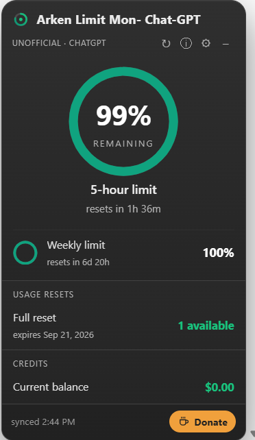
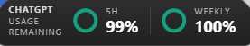
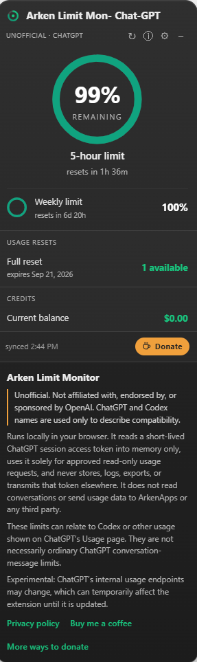
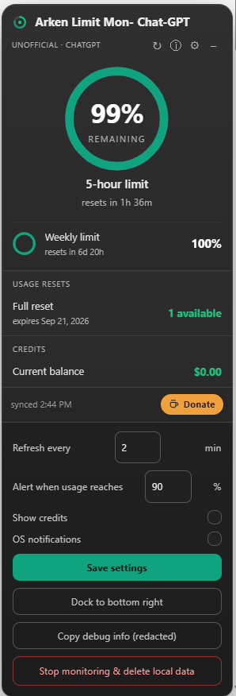

<p align="center">
  <picture>
    <source media="(prefers-color-scheme: dark)" srcset="docs/assets/wordmark.png">
    <source media="(prefers-color-scheme: light)" srcset="docs/assets/wordmark-light.png">
    
  </picture>
</p>

<p align="center">
  <a href="https://github.com/arkenapps/ArkenLimitMonitor-ChatGPT/releases/latest"></a>
  
  
  <a href="LICENSE"></a>
  
</p>

<h1 align="center">Arken Limit Monitor &mdash; Usage Meter for ChatGPT</h1>

<p align="center">
  <b>Unofficial. Not affiliated with, endorsed by, or sponsored by OpenAI.</b><br>
  A local browser widget that shows your own ChatGPT usage limits &mdash; the
  5-hour window, the weekly window, reset countdowns and your credit balance
  &mdash; without leaving the page.
</p>

<p align="center">
  <a href="https://github.com/arkenapps/ArkenLimitMonitor-ChatGPT/releases/latest/download/ArkenLimitMonitor-ChatGPT-extension.zip"></a>
  &nbsp;
  <a href="https://arkenapps.com/limit-monitor"></a>
  &nbsp;
  <a href="https://arkenapps.github.io/ArkenLimitMonitor-ChatGPT/"></a>
</p>

> **Experimental.** It reads ChatGPT's own usage endpoints using your existing
> browser session, so it can break if OpenAI changes them.

<p align="center"></p>

## What it shows

| | |
|---|---|
| **5-hour limit** | The current rolling window as a ring gauge, with a live "resets in 1h 36m" countdown |
| **Weekly limit** | Your weekly window and when it rolls over |
| **Usage resets** | Full resets available to you and the date they expire |
| **Credits** | Current balance, when your account exposes one |
| **Threshold alerts** | An optional desktop notification when you cross a level you pick (default 90%) |
| **Collapses away** | One click folds it into a pill docked at the bottom edge &mdash; drag it anywhere |

<p align="center"></p>

> These figures can relate to Codex or other usage shown on ChatGPT's Usage
> page. They are not necessarily ordinary ChatGPT conversation-message limits.

## Install

**Option A &mdash; download the packaged extension** (recommended)

1. Download **`ArkenLimitMonitor-ChatGPT-extension.zip`** from the
   [latest release](https://github.com/arkenapps/ArkenLimitMonitor-ChatGPT/releases/latest)
   &mdash; or from [arkenapps.com](https://arkenapps.com/arken-limit-monitor-chatgpt)
   &mdash; and **unzip** it.
2. Open `chrome://extensions` (or `edge://extensions`).
3. Turn on **Developer mode** (top-right).
4. Click **Load unpacked** and select the unzipped **`ArkenLimitMonitor-ChatGPT`**
   folder (the one with `manifest.json` in it).
5. Open or refresh **chatgpt.com**, then allow monitoring when the widget asks.

**Option B &mdash; load straight from the source**

```bash
git clone https://github.com/arkenapps/ArkenLimitMonitor-ChatGPT.git
```

Then **Load unpacked** and select the `extension/` folder from the clone. Same
code, no download step &mdash; handy if you want to read it before you run it.

Works on Chrome, Edge, Brave, Arc, Vivaldi and other Chromium browsers on
Windows, macOS and Linux.

## Consent, once

On first run the widget asks before it reads anything. Nothing is requested
until you press **Allow automatic monitoring**, and **Stop monitoring & delete
local data** in settings withdraws that consent and clears everything stored.

<p align="center"></p>

## Settings

- **Refresh every** &mdash; minutes between polls (minimum 2), plus a manual refresh button
- **Alert when usage reaches** &mdash; threshold % for the desktop notification
- **Show credits** &mdash; show or hide the credits panel
- **OS notifications** &mdash; turn desktop alerts on or off
- **Dock to bottom right** &mdash; resets the widget to its default position
- **Copy debug info (redacted)** &mdash; percentages and reset times only, with no
  account identifiers and no token, for reporting issues
- **Stop monitoring & delete local data** &mdash; withdraws consent and clears storage

<p align="center"></p>

## Privacy

This extension runs **locally** in your browser. There is no external server and
no telemetry of any kind. Your settings live in `chrome.storage.local` on your
own machine.

It reads a short-lived ChatGPT session access token into memory only, uses it
solely for approved read-only usage requests, and never stores, logs, exports or
transmits that token anywhere. It does not read your conversations. It does not
ask for a username, password or API key. It does not send usage data to ArkenApps
or any third party.

The request allowlist is enforced in code &mdash; the token is only ever attached
to the specific usage and reset-credit endpoints, and nothing else.

Full policy: [arkenapps.github.io/ArkenLimitMonitor-ChatGPT/#privacy](https://arkenapps.github.io/ArkenLimitMonitor-ChatGPT/#privacy)

## Known limitations

- Depends on undocumented usage endpoints; an OpenAI change may require a patch.
  It fails quietly and shows the last known figures rather than breaking the page.
- Shows whatever limits your plan exposes &mdash; plans differ.
- The credits panel only appears if your account exposes credit figures.
- The reported limits may cover Codex or other usage rather than ordinary
  conversation messages.
- Safari isn't supported by "Load unpacked"; it would need a Safari Web Extension
  conversion via Xcode on macOS.

## Changelog

**1.1.0** &mdash; First public release. Consent-gated monitoring, 5-hour and weekly
rings, reset availability with expiry dates, credit balance, threshold alerts,
draggable collapsed pill, and a redacted debug export.

## Contributing

Issues and pull requests are welcome. If you're reporting a wrong number, the
**Copy debug info** button in settings gives you everything needed to diagnose it
without exposing your account.

## Support development

Free and open source. If it saves you from a mid-task cutoff, a small tip keeps
it maintained &mdash; no nags, no locked features.

- **Buy Me a Coffee:** https://buymeacoffee.com/arkenstone
- **Crypto**
  - BTC &mdash; `bc1q38s0238vt0qmy20e67v8yh563gd569detagr04`
  - ETH (ERC-20) &mdash; `0x3Ee64cde0220D32998B442caADdDF8384309befc`
  - BNB (BEP-20) &mdash; `0x3Ee64cde0220D32998B442caADdDF8384309befc`
  - USDT (TRC-20) &mdash; `TKabLe5AuCATij3u1zx116W5zHLb6eD5Um`
  - USDC (Solana/SPL) &mdash; `9v64bkPMaM1KFFGGe83U7Mv3mBWTGW29qz4hXE9DNL2v`
  - SOL &mdash; `9v64bkPMaM1KFFGGe83U7Mv3mBWTGW29qz4hXE9DNL2v`
  - XRP &mdash; `r4RKyUK5sJfFrjXBFjYuwpJ2rnerPdDDpW`

Donate page with QR codes: https://arkenapps.github.io/ArkenLimitMonitor-ChatGPT/#donate

## Related

Using Claude too? The sister extension is
[Arken Limit Monitor &mdash; Usage Meter for Claude](https://github.com/arkenapps/ArkenLimitMonitor).

## License

MIT &copy; Arken Apps. See [LICENSE](LICENSE).

"ChatGPT", "Codex" and "OpenAI" are trademarks of OpenAI, used here only to
describe compatibility.
